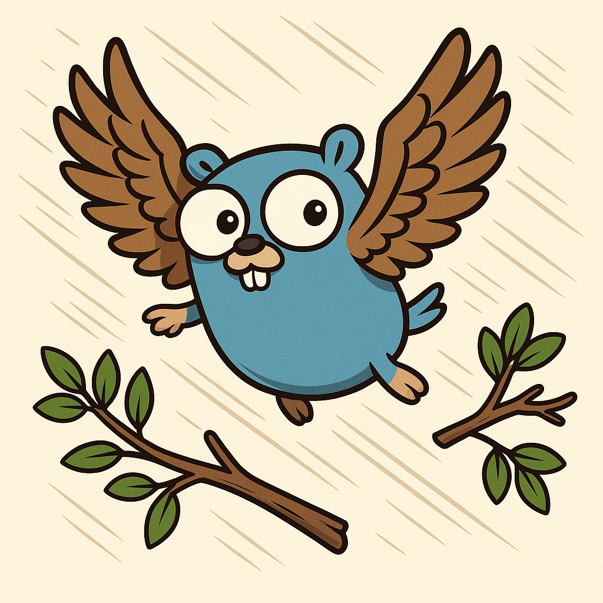

# go-sparrow

<div align="center">
  
</div>

A Neovim plugin that provides enhanced navigation for Go files using treesitter. Fly inside the code tree fast like a sparrow!

## Features

- **Function Declaration Navigation** - Jump between function and method declarations
- **Expression Statement Navigation** - Navigate function calls in expression statements  
- **Function Call with Assignment Navigation** - Move between function calls with variable assignments
- **Smart Filtering** - Ignore common logging functions during navigation
- **Count Support** - Use count prefixes to jump multiple items at once
- **Caching System** - Optimized performance for repeated navigation
- **Unified Repeat Motion** - Repeat last navigation command across all navigation types

## Installation

### lazy.nvim

```lua
{
  'SearidangPa/go-sparrow',
  ft = 'go',
  lazy = true,
  opts = {},
}
```

### Custom Configuration

```lua
{
  'SearidangPa/go-sparrow',
  ft = 'go',
  config = function()
    require('go-sparrow').setup({
      -- Set to false to disable default keymaps
      keymaps = true,
      
      -- Custom keybindings (optional)
      next_function_declaration = ']m',
      prev_function_declaration = '[m',
      next_expression_statement = ']e', 
      prev_expression_statement = '[e',
      next_function_call = ']f',
      prev_function_call = '[f',
      repeat_last_motion = '\\',
    })
  end,
}
```

### Manual Keybinding Setup

```lua
{
  'SearidangPa/go-sparrow',
  ft = 'go',
  config = function()
    local sparrow = require('go-sparrow')
    
    -- Disable default keymaps
    sparrow.setup({ keymaps = false })
    
    -- Set up custom keybindings
    vim.keymap.set('n', '<leader>fn', sparrow.next_function_declaration, { desc = 'Next function' })
    vim.keymap.set('n', '<leader>fp', sparrow.prev_function_declaration, { desc = 'Previous function' })
    vim.keymap.set('n', '<leader>en', sparrow.next_expression_statement, { desc = 'Next expression' })
    vim.keymap.set('n', '<leader>ep', sparrow.prev_expression_statement, { desc = 'Previous expression' })
    vim.keymap.set('n', '<leader>cn', sparrow.next_function_call, { desc = 'Next function call' })
    vim.keymap.set('n', '<leader>cp', sparrow.prev_function_call, { desc = 'Previous function call' })
    vim.keymap.set('n', '<leader>cr', sparrow.repeat_last_motion, { desc = 'Repeat last motion' })
  end,
}
```

## Default Keybindings

| Key | Action |
|-----|--------|
| `]m` | Next function declaration |
| `[m` | Previous function declaration |
| `]e` | Next expression statement |
| `[e` | Previous expression statement |
| `]f` | Next function call with assignment |
| `[f` | Previous function call with assignment |
| `\` | Repeat last motion (any navigation type) |

## Usage

All navigation commands support count prefixes:
- `3]m` - Jump to the 3rd next function declaration
- `2[e` - Jump to the 2nd previous expression statement

The repeat motion feature works across all navigation types:
- Use any navigation command (`]m`, `[e`, `]f`, etc.)
- Then press `\` to repeat the same motion and direction
- The repeat command remembers which navigation type and direction was used last

## API

```lua
local sparrow = require('go-sparrow')

sparrow.next_function_declaration()
sparrow.prev_function_declaration()
sparrow.next_expression_statement()
sparrow.prev_expression_statement()
sparrow.next_function_call()
sparrow.prev_function_call()
sparrow.repeat_last_motion()
```

## Requirements

- Neovim 0.8+ with treesitter support
- Go treesitter parser installed

## License

MIT
